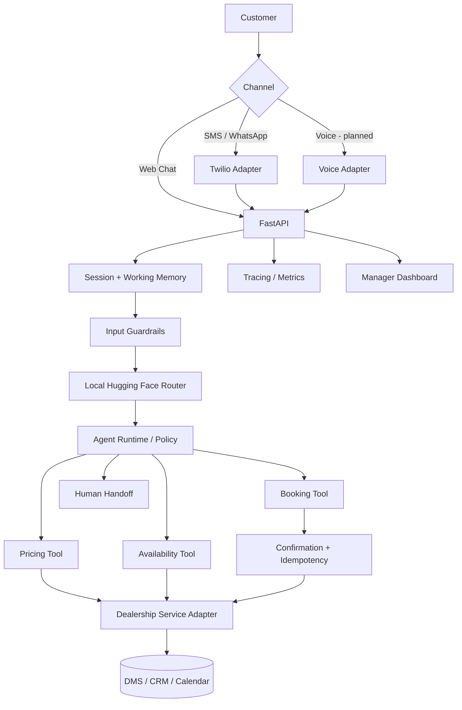

# DealerFlow AI Architecture

## Design principles

- The LLM interprets language; deterministic services own business truth.
- Booking writes require explicit confirmation.
- Idempotency protects against duplicate appointment creation.
- High-risk/safety issues are escalated to humans.
- Channel adapters share one runtime instead of duplicating business logic.
- Traces support debugging and future evaluation/monitoring.
